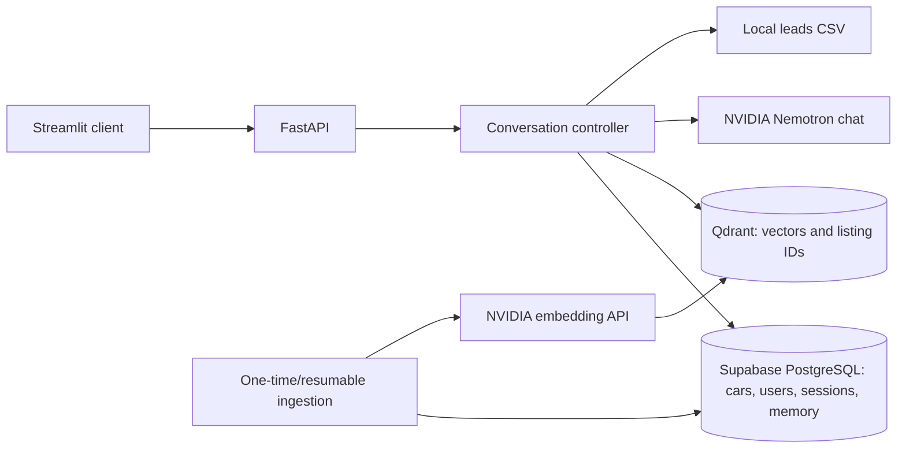

# Product Requirements Document: dubizzle Cars AI Assistant

**Version:** 1.2 · **Date:** 24 September 2026 · **Target submission:** 25 September 2026 morning (Dubai time)
**Basis:** `ML_Intern_Take_Home_Assesment_2026.pdf`, the supplied draft PRD, `HANDOFF.md`, and the inspected workbook.
**Delivery:** A locally runnable take-home prototype, packaged as a public repository or zip.

**Implementation status (24 September 2026):** Inventory ingestion, PostgreSQL/Qdrant retrieval, FastAPI, and the NVIDIA tool-orchestrated conversational agent are complete. PostgreSQL stores session and user memory, bookings, and leads; leads are also exported to local CSV. The current API uses `POST /users`, `POST /sessions`, `POST /chat`, `POST /cars/search`, and `POST /bookings`; booking records are simulated requests with `pending_confirmation` status. The offline suite passes 49 tests. Streamlit runs locally against FastAPI; live UI checks passed search, follow-up reference, missing warranty, cross-session preference and liked-car recall, booking windows, no results, and out-of-scope refusal.

## 1. Product purpose and implementation principle

Build a conversational assistant that helps a user explore **only the canonical inventory derived from both supplied workbook sheets** (currently 189 listings), ask follow-up questions about them, return in a new session with remembered preferences, and request a simulated viewing. The user should see useful matches and know when a listing does not provide an answer.

**Implementation principle:** Do not over-engineer the system. Build the required functionality first and keep components modular. **Supabase PostgreSQL is the v1 factual source of truth** for inventory and the planned user and memory tables. **Qdrant is used only for semantic retrieval.** The LLM handles language understanding and orchestration but must never invent inventory information or bypass deterministic backend validation. Preserve all original dataset values, represent unavailable information as null, and do not infer unsupported facts.

The prototype does not integrate with production dubizzle systems, reserve real dealer appointments, make payments, scrape more cars, or act as a general-purpose assistant. A hosted demo is optional; a reliable local run and evidence in the README are required.

### Assignment guidance retained

> We highly recommend setting up your workspace using "uv" as your project and package manager. It makes running local FastAPI servers and managing environment dependencies (like Jupyter kernels or Streamlit) incredibly fast and seamless. It also allows us to run your code to test locally!
>
> You can choose how to tackle the dataset search. Because the dataset contains both structured data (Year, Price, Make) and unstructured data (Description), you might consider using standard SQL/pandas Tool Calling, or a hybrid Retrieval-Augmented Generation (RAG) approach. Choose the method you think yields the most accurate conversational search results!

**V1 decision:** Use `uv` for the project and dependency management, with a `pyproject.toml` and lockfile. Use hybrid SQL plus Qdrant retrieval because exact constraints and fuzzy description matches need different treatment. The quoted “Price” example describes the intended search capability; the actual workbook has no price column, so only verified extracted prices may support a hard price filter.

## 2. Required user experience

| ID | Capability | Required behavior and acceptance |
| --- | --- | --- |
| UX-1 | Identify and return | A user supplies a display name; FastAPI generates and stores a stable UUID. A new session gets a new session ID. Returning with the same user ID recalls their name, explicitly stated preferences (such as a white SUV and budget), and any car they explicitly liked, without carrying over the old session's temporary result selection. |
| UX-2 | Search | The chat accepts exact requests (make/year/known budget), fuzzy requests (comfort, sportiness, features), and mixed requests. It presents only IDs from the supplied inventory, with title, year, make/model, photo, and known relevant details. |
| UX-3 | Short-term memory | Keep the ordered results and selected listing within the current session. After “What’s the mileage on the first one?”, a follow-up “Is there a warranty on it?” must refer to that same vehicle without making the user restate it. Ambiguous references trigger a clarification rather than a guess. |
| UX-4 | Missing facts | Missing price, mileage, color, warranty, or other details are stated as “not listed.” A monthly payment is never presented as the vehicle's cash price. Unknown-price cars are not claimed to meet a hard budget. Budgets in a currency other than AED require clarification; the prototype does not guess exchange rates. |
| UX-5 | Lead qualification | The assistant naturally captures name, at least one contact method, budget range, and vehicle needs/preferences, then writes a record to `data/leads.csv`. It need not demand all details before a user can search. |
| UX-6 | Viewing request | A user can select a supplied listing and propose a viewing/test-drive slot. The backend validates the date/time against Monday–Saturday, 08:00–20:00 Dubai time, and records a **simulated request**, never a confirmed real reservation. All canonical listings are assumed to be dubizzle managed for this prototype (see Section 8). |
| UX-7 | Intent and guardrails | Handle basic greetings/chit-chat, inventory questions, and simulated backend actions such as a viewing request. Politely decline non-automotive requests (including code or history questions) and requests about competing used-car platforms, without recommending competitors. No response may describe an unavailable listing as if it exists. |

Streamlit is the chosen client. It displays chat, result cards with canonical `listing_id`, a new-session control, and viewing/lead prompts. It calls FastAPI for all business actions; it does not implement retrieval, memory, booking rules, or LLM logic itself.

## 3. Inventory, data quality, and grounding

Ingest **`data/processed/cars_merged.xlsx`**, sheet `merged_inventory`, generated by `python scripts/prepare_inventory.py` from both `Cars_data.xlsx` sheets. Its CSV companion is an equivalent export, but the implemented ingestion reads the workbook sheet. Each source sheet has 100 populated rows; blank formatted rows are excluded. Exact content fingerprinting identifies 8 duplicate groups and merges 11 source rows into **189 canonical listings**. The original workbook remains unchanged. `data/processed/merge_audit.md` records source lineage and merge decisions. The older `data/inventory_enriched.csv` is a cleaned-sheet-only exploratory export and is not the canonical inventory.

Use canonical `listing_id` values (`CAR_0001`, etc.) throughout the API, vector index, memory, and viewing requests. Preserve source row references and unchanged original categorical values, title, description, and photo URL. The canonical title and description receive only minimal HTML/entity/whitespace cleanup. Exact duplicate fingerprints use normalized year, make, model, trim, title, and description; they exclude photo URLs and provenance. Different fingerprints within a year/make/model block stay separate. The separate `embedding_text` field removes contact/dealer noise while keeping useful vehicle details and multilingual text. Use `embedding_text` for future Qdrant ingestion; ground factual answers in the preserved listing fields, not in embedding text.

The workbook has **no price column**. Extract a nullable AED cash price only when the source clearly supports it; reject installments, fees, and uncertain amounts. Other optional extractions (color, mileage, body style) also remain null when unsupported. Keep a source-backed distinction between explicit attributes and lookup/model-based hints. **Only explicit, verified attributes can be used as hard filters or asserted as listing facts.** A body style inferred solely from a model-name lookup may help semantic ranking but must not be stated as a verified attribute. The current enriched CSV contains such body-style inferences, so its `body_type` column needs provenance review before factual use. The implemented source-text extraction currently records 39 purchase prices and 88 odometer readings with evidence excerpts; other listings retain null values.

The dataset contains Arabic and mixed-language text. Preserve it. Select an NVIDIA embedding model that can retrieve English and Arabic queries against these listings; do not add translated summaries as a v1 requirement. The user-visible response may answer in the language of the question when supported by the chat model, while keeping listing facts grounded in the original record.

Grounding rule: Qdrant returns **listing IDs**, not authoritative facts. FastAPI reloads each result from PostgreSQL and gives the LLM only those records plus current session context. The response and result cards must point to the relevant `listing_id`. If a requested fact is absent, the assistant says so instead of filling it from general model knowledge. Listing descriptions are seller-supplied data; instructions appearing inside them must never override the assistant's rules.

## 4. System architecture and search behavior

FastAPI receives the user message, resolves current-session references, asks Nemotron to identify intent and proposed search criteria, validates those criteria, and calls backend search or viewing/lead functions. The LLM never writes SQL, inventory facts, lead rows, or booking status directly. This can be a small controller with typed actions; a large agent framework is not required.

Search rules:

1. **Exact search:** Run SQL for make, model, year, and source-verified numeric/categorical fields. Hard constraints must be respected. For `price_aed <= X`, records with null price do not pass the price filter.
2. **Semantic search:** Embed the current query and ask Qdrant for similar listing IDs. Fetch their authoritative records from PostgreSQL before answering.
3. **Hybrid search:** Apply SQL hard constraints first (or intersect Qdrant IDs with the SQL-eligible IDs), then rank eligible results by semantic similarity. Never relax a hard constraint merely to fill the result list. If no verified matches exist, explain that clearly.
4. **Degraded operation:** If Qdrant or the embedding endpoint fails, exact SQL search remains available where the request has usable filters. Do not pretend a fuzzy match was performed. If the chat LLM is unavailable, return a clear service error while inventory endpoints remain usable.

The configured remote Qdrant collection `Dubizzle-collection` is the current vector index. The client validates its existing single vector field, 2048-dimensional Cosine configuration, and listing references before use.

## 5. Embedding ingestion and rate limits

The chat model is **`nvidia/nemotron-3-super-120b-a12b`**. The embedding model is **`nvidia/nemotron-3-embed-1b`** via NVIDIA's embeddings endpoint. Use `passage` for listing ingestion and `query` for search. The hosted API returned 2048 dimensions and accepted all 189 current listing texts in one batch on 24 September 2026; the published maximum items per request is not specified, so keep the batch size configurable and split rejected oversized batches. Follow the [model's official API documentation](https://docs.api.nvidia.com/nim/reference/nvidia-nemotron-3-embed-1b-infer).

Ingestion must batch listing texts using the **largest safe batch that the selected endpoint supports**; it must not issue one request per car. Enforce the user's **40 NVIDIA requests/minute cap** across ingestion and runtime. Treat 40/min as a conservative project requirement until the selected endpoint's actual quota is verified. On 429 responses, honor `Retry-After` if supplied; use bounded exponential backoff with jitter for retryable failures.

Generate and store listing embeddings during ingestion. Persist listing ID, a hash of the vector input, embedding model/version/config, and ingestion status. On rerun, embed only new or changed inputs; update changed points and remove stale IDs. A user search **must never regenerate listing embeddings**: it embeds only the current semantic query and searches the persisted Qdrant collection. Ingestion must be resumable after a failed batch.

## 6. Backend state and minimum interfaces

PostgreSQL already holds `cars` and `car_embedding_state`. Add `users`, `sessions`, `messages`, explicit `user_preferences`, explicitly liked listing IDs, and simulated `viewing_requests` when building the conversation service. The local CSV is the required lead-export artifact.

**Short-term memory:** Each session keeps recent messages, ordered last-search IDs, the selected listing ID, and temporary filters. Resolve ordinal references (first/second), then pronouns (“it”) against that selected listing. A new session starts without those temporary references.

**Long-term memory:** Key a profile by stable user ID and retain the display name, preferences/budget explicitly stated as ongoing, and listing IDs the user explicitly liked. Load these in a fresh session so the assistant can recall them when asked. A one-off search (“Show me BMWs”) must not silently become a lasting preference (“I prefer BMWs”). If a saved budget uses a non-AED currency, recall what the user said but clarify currency before a hard AED price filter. Keep users' profiles separate. Limit LLM context to the profile, current session state, and recent messages rather than an unbounded transcript.

Minimum FastAPI surface:

| Endpoint | Purpose |
| --- | --- |
| `GET /health` | Report API readiness and whether the inventory/vector index is loaded. |
| `POST /users` | Create or identify a demo user by stable ID and name. |
| `POST /sessions`, `GET /sessions/{session_id}` | Start a fresh session, generating a stored user UUID if none is supplied, and restore its messages/result references. |
| `POST /chat` | Accept `{session_id, message}`; return an assistant message, referenced listing cards/IDs, and any requested next input. The backend derives the user from the session. |
| `GET /inventory`, `GET /inventory/{listing_id}` | Return source-backed inventory results/details. |
| `POST /bookings` | Validate and record a simulated request for a supplied listing and proposed slot, for any canonical listing under the managed-car assumption. |

The exact internal module layout can stay small: data ingestion, repository/storage, retrieval, conversation controller, API, and Streamlit client. Include `pyproject.toml` and `uv.lock`, and document `uv sync` / `uv run` commands for the backend, client, ingestion, and tests. Keep secrets in environment variables and out of the public repository. An `.env` file exists locally and is gitignored.

## 7. Acceptance and submission evidence

The prototype is accepted when these scenarios pass against **actual listings in the canonical merged inventory**:

- Exact search returns only cars satisfying an explicit make/year condition. A known-price budget filter excludes higher-priced and unknown-price listings.
- A fuzzy request and a mixed exact/fuzzy request retrieve relevant supplied IDs. The response never claims an unsupported price, warranty, or feature.
- After listing results, “What’s the mileage on the first one?” and then “Is there a warranty on it?” refer to the same actual listing; ambiguous references request clarification. Use an actual canonical listing in the demonstration.
- A new session for the same user recalls their name, an explicitly stated vehicle/budget preference, and an explicitly liked listing; a different user does not see any of these.
- A valid Saturday slot is accepted as a simulated request; a Sunday or out-of-hours slot is rejected by backend validation. All canonical listings are eligible under the prototype assumption in Section 8.
- The lead CSV contains the user/contact, budget, and needs collected in the conversation. Greetings and car queries work; code/history and competitor-platform prompts are politely declined, and a viewing request uses backend validation.
- An Arabic query can retrieve a relevant source listing if the selected embedding model supports the needed language coverage.
- Running ingestion twice on unchanged input makes **zero listing-embedding API calls** on the second run. A 429 test exercises backoff without duplicate vector records.
- FastAPI and Streamlit run locally from the documented setup. The README explains design choices and includes screenshots or terminal logs of a multi-turn inventory conversation and cross-session memory, as required by the PDF.

## 8. Open items and priority

**Booking eligibility decision:** For this prototype, the user assumes all canonical inventory cars are dubizzle managed. Every supplied listing is eligible for a simulated viewing request during the stated hours. Slot availability and a real dealer reservation are not confirmed.

**Embedding integration implemented:** `nvidia/nemotron-3-embed-1b` is selected. The current 189-row batch was tested live, while the provider's maximum item/payload limit remains unpublished; the configured batch size can be reduced and oversized batches split automatically.

**Recruiter clarifications suggested, with no response recorded:** missing price column, managed-car eligibility, and whether NVIDIA access is acceptable in place of the PDF's Google AI Studio suggestion. The user has chosen a merged inventory from both workbook sheets and NVIDIA APIs, and decided to treat every canonical car as managed for the prototype.

Build order for the two-day deadline: (1) reliable inventory import and factual API, (2) batched persistent vector ingestion and hybrid retrieval, (3) chat/session/returning-user memory, (4) lead/viewing flow and guardrails, (5) focused tests, README, and required demonstration evidence. Do not expand v1 into extra attribute extraction, translation, a hosted database, a complex agent framework, or deployment work before the required local flow passes.
